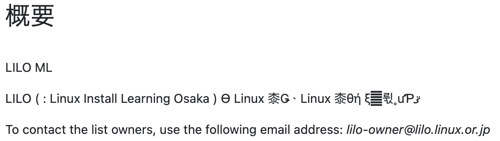

# lilo.linux.or.jpをbusterからbullseyeに上げた

author
:   Kazuhiro NISHIYAMA

content-source
:   LILO&東海道らぐオフラインミーティング

date
:   2024-01-28

allotted-time
:   10m

theme
:   lightning-simple

# 自己紹介

- 西山 和広
- Ruby のコミッター
- twitter, github など: @znz
- 株式会社Ruby開発 www.ruby-dev.jp

# lilo.linux.or.jp とは

- LILO の Web やメーリングリスト
- さくらの VPS
- Debian GNU/Linux

# 更新対象

- Debian GNU/Linux 10 (buster) = oldoldstable
  - Current LTS: August 1st, 2022 to June 30th, 2024
- Debian GNU/Linux 11 (bullseye) = oldstable
  - Future LTS: August 15th, 2024 to June 30th, 2026
- https://wiki.debian.org/LTS

# 事前チェックしたもの

- https://packages.debian.org/libpam-google-authenticator
  - 20170702-2 → 20191231-2
  - メンテナンスされてるし、非互換もなさそう
- https://packages.debian.org/dokuwiki
  - 0.0.20180422.a-2 → 0.0.20180422.a-2.1
  - もっと新しいバージョンに上げるときは何か対応が必要かも

# 事前チェックしたもの

- milter-manager
  - Debian 公式以外から入れているので
  - https://packagecloud.io/milter-manager/repos に bullseye と el/7,8,9 しかなさそう
  - https://packages.debian.org/milter-manager もまだない

# 更新

- 事前に想定していたものは問題なく上がった
- `dpkg -l | awk '/^rc/ { print $2 }'` で mailman が消えていることに気付く

# mailman → mailman3

- 検索して出てきたブログ記事を参考にして作業
  - https://blog.daionet.gr.jp/knok/2021/10/13/mailman2-3-migration-on-debian/ など
- 消えてしまったので mailman 2.1 のコマンドを使った調査は不可能

# パッケージインストール

- `mailman3` `mailman3-web` `mailman3-full` と別々に入れてしまった
- 最初から `mailman3-full` を入れた方が良かったと後でわかった
- データベースを dbconfig-common で設定しますか? は「はい」にした

# コマンド

- `mailman3` の操作は `sudo mailman-wrapper` を使う
- `mailman3-web` の操作は `sudo /usr/share/mailman3-web/manage.py` を使う

# リスト作成

```
nishiyama@chiyoko:~$ sudo mailman-wrapper lists
No matching mailing lists found
nishiyama@chiyoko:~$ sudo mailman-wrapper create lilo-XXX@lilo.linux.or.jp
Created mailing list: lilo-XXX@lilo.linux.or.jp
nishiyama@chiyoko:~$ sudo mailman-wrapper lists
1 matching mailing lists found:
lilo-XXX@lilo.linux.or.jp
```

# 設定移行

- `sudo mailman-wrapper import21 lilo-XXX@lilo.linux.or.jp /var/lib/mailman/lists/lilo-XXX/config.pck`
- どこまで移行できているかは未確認

# アーカイブ移行

- `sudo /usr/share/mailman3-web/manage.py hyperkitty_import -l lilo-XXX@lilo.linux.or.jp /var/lib/mailman/archives/private/lilo-XXX.mbox/lilo-XXX.mbox`
- `1%Failed adding message <mailman.18.1404008960.2993.webmasters@lilo.linux.or.jp>: 'iso2022_jp' codec can't encode character '\uff7b' in position 62: illegal multibyte sequence` のようにエンコーディングの問題のあるメールがたくさんあった
  - たぶん spam とかだけなので無視

# postfix 設定

- `alias_maps` から `hash:/var/lib/mailman/data/aliases` を削除
- `/usr/share/doc/mailman3/README.Debian` にあった設定を追加

```
owner_request_special = no
transport_maps = hash:/var/lib/mailman3/data/postfix_lmtp
local_recipient_maps = proxy:unix:passwd.byname $alias_maps hash:/var/lib/mailman3/data/postfix_lmtp
relay_domains = ${{$compatibility_level} < {2} ? {$mydestination} : {}} hash:/var/lib/mailman3/data/postfix_domains
```

# apache2 設定

- `Include /etc/mailman3/apache.conf` 追加
- `sudo a2enmod proxy_uwsgi`
- `sudo systemctl restart apache2`
- 後で `RedirectMatch ^/cgi-bin/mailman https://lilo.linux.or.jp/mailman3/` も追加した

# 管理画面

- `/mailman3/admin` にある
- `sudo /usr/share/mailman3-web/manage.py createsuperuser` で管理者追加
  - とりあえず `nishiyama` だけ追加

# 管理画面で変更

- Mail domain に lilo.linux.or.jp を追加 (サイトは example.com だった)
- サイトで example.com を lilo.linux.or.jp に変更 (ドメイン名と表示名の両方)

# lilo ML も移行

- `sudo mailman-wrapper create lilo@lilo.linux.or.jp`
- `sudo mailman-wrapper import21 lilo@lilo.linux.or.jp /var/lib/mailman/lists/lilo/config.pck`
- `sudo /usr/share/mailman3-web/manage.py hyperkitty_import -l lilo@lilo.linux.or.jp /var/lib/mailman/archives/private/lilo.mbox/lilo.mbox`

# 文字化け対応

- 説明が文字化けしていた

{:relative_height='50'}

# 復元

旧データからバイナリで抽出

```
nishiyama@chiyoko:~$ sudo hexdump -C /var/lib/mailman/lists/lilo/config.pck | less

00004750  49 4c 4f 20 28 20 a4 ea  a4 ed 20 3a 20 4c 69 6e  |ILO ( .... : Lin|
00004760  75 78 20 49 6e 73 74 61  6c 6c 20 4c 65 61 72 6e  |ux Install Learn|
00004770  69 6e 67 20 4f 73 61 6b  61 20 29 20 a4 cf b4 d8  |ing Osaka ) ....|
00004780  c0 be a4 ce 20 4c 69 6e  75 78 20 a5 e6 a1 bc a5  |.... Linux .....|
00004790  b6 b2 f1 a4 c7 a4 b9 a1  a3 20 bc e7 a4 cb b4 d8  |......... ......|
000047a0  c0 be a4 ce 20 4c 69 6e  75 78 20 a5 e6 a1 bc a5  |.... Linux .....|
000047b0  b6 a4 ce b8 f2 ce ae a1  a2 be f0 ca f3 b8 f2 b4  |................|
000047c0  b9 20 a4 ce be ec a4 f2  c4 f3 b6 a1 a4 b9 a4 eb  |. ..............|
000047d0  a4 bf a4 e1 a4 cb b3 e8  c6 b0 a4 b7 a4 c6 a4 a4  |................|
000047e0  a4 de a4 b9 a1 a3 71 7a  55 20 62 6f 75 6e 63 65  |......qzU bounce|
```

# 復元

NKF で文字コードの確認と変換

```
#!/usr/bin/env ruby

data = <<EOD
49 4c 4f 20 28 20 a4 ea  a4 ed 20 3a 20 4c 69 6e
75 78 20 49 6e 73 74 61  6c 6c 20 4c 65 61 72 6e
69 6e 67 20 4f 73 61 6b  61 20 29 20 a4 cf b4 d8
c0 be a4 ce 20 4c 69 6e  75 78 20 a5 e6 a1 bc a5
b6 b2 f1 a4 c7 a4 b9 a1  a3 20 bc e7 a4 cb b4 d8
c0 be a4 ce 20 4c 69 6e  75 78 20 a5 e6 a1 bc a5
b6 a4 ce b8 f2 ce ae a1  a2 be f0 ca f3 b8 f2 b4
b9 20 a4 ce be ec a4 f2  c4 f3 b6 a1 a4 b9 a4 eb
a4 bf a4 e1 a4 cb b3 e8  c6 b0 a4 b7 a4 c6 a4 a4
a4 de a4 b9 a1 a3 71 7a  55 20 62 6f 75 6e 63 65
EOD
s = [data.delete(" \n")].pack('H*')

require 'nkf'
p NKF.guess(s)
p NKF.nkf('-w', s)
```

# 復元

実行して結果を使って再設定

```
ruby -v /tmp/s.rb
ruby 3.2.3 (2024-01-18 revision 52bb2ac0a6) [arm64-darwin23]
#<Encoding:EUC-JP>
"ILO ( りろ : Linux Install Learning Osaka ) は関西の Linux ユーザ
会です。 主に関西の Linux ユーザの交流、情報交換 の場を提供するために
活動しています。qzU bounce"
```

# ML でアナウンス

- 移行しましたアナウンスメールを送信
- テストメールを兼ねている
- アーカイブに反映されなかった

# アーカイバー設定

- `mailman3-full` で入る `python3-mailman-hyperkitty` を使う
- `/etc/mailman3/mailman-hyperkitty.cfg` の `base_url` 変更
- `/etc/mailman3/mailman.cfg` に設定追加

```
[archiver.hyperkitty]
class: mailman_hyperkitty.Archiver
enable: yes
configuration: /etc/mailman3/mailman-hyperkitty.cfg
```

# エラー確認

```
Jan 27 15:36:05 2024 (150036) HyperKitty failure on
https://lilo.linux.or.jp/mailman3/hyperkitty/api/mailman/urls:
<html><title>Forbidden</title><body>
<h1>Access is forbidden</h1><p>Please check the IP addresses
assigned to MAILMAN_ARCHIVER_FROM in the settings file.
</p></body></html> (403)
```

# 設定

- apache2 のアクセスログで接続元 IP アドレスを確認
  - 自分の IPv6 アドレスだった
- `/etc/mailman3/mailman-web.py` に自身のグローバル IP アドレス追加
  - ねんのため IPv4 も足した

```
MAILMAN_ARCHIVER_FROM = ('127.0.0.1', '::1',
'2401:2500:102:2213:133:242:207:124',
'133.242.207.124')
```

# さらに確認

- またメールを送って登録されるのを確認した

# milter-manager + milter-greylist

- 途中 `mail.log` を確認したときにエラーがでていた

```
milter-manager[133047]: [13] [children][error][connection] [14] Failed to connect to unix:/var/run/milter-greylist/milter-greylist.sock: 許可がありません: milter-greylist
milter-manager[133047]: [13] [leader][error] Failed to connect to unix:/var/run/milter-greylist/milter-greylist.sock: 許可がありません
```

- 試行錯誤中でまだ未解決
- <https://github.com/milter-manager/milter-manager/issues/205> で質問中

# まとめ

- buster (oldoldstable) から bullseye (oldstable) に更新できた
- リリースノートの確認不足で mailman でひっかかった
- milter-manager はどうなる?
- ドメイン管理の関係で SPF,DKIM,DMARC などもやりにくいので、メールサーバーをやめてしまのもありかも?
